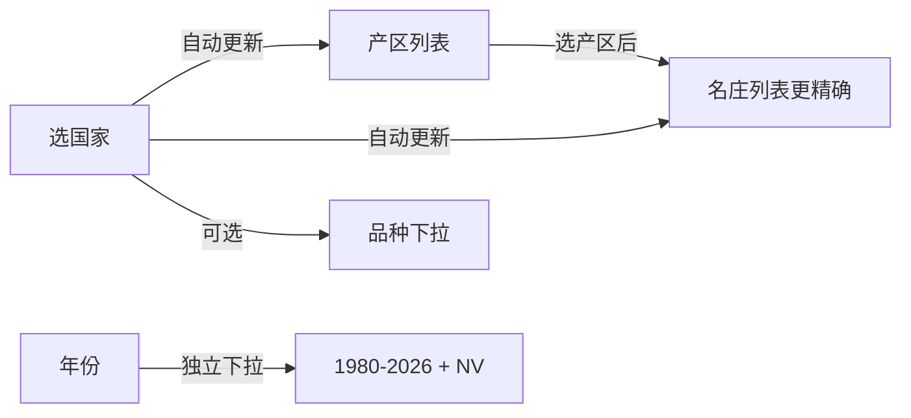

# 级联菜单 + 可编辑个人中心 修改完成

## cascade 1: 酒款级联菜单（基于《世界葡萄酒地图》标准）

### 新增文件
- `lib/models/wine_region_data.dart` — 完整的葡萄酒世界数据结构

### 修改文件
- `lib/screens/tasting_form_screen.dart` — 品鉴表单的五个字段改造

### 数据覆盖
- **国家**: 30 个主要产酒国（法国、意大利、西班牙、中国...）
- **产区**: 每个国家 5-15 个核心产区（法国: 波尔多/勃艮第/香槟/罗讷河谷...）
- **酒庄**: 按国家+产区联动的名庄推荐（拉菲、罗曼尼康帝、奔富、银色高地...）
- **葡萄品种**: 12 大类 70+ 品种，含中文名+国际名双语
- **经典混酿**: 13 种经典配方（波尔多红/GSM/香槟/超级托斯卡纳...）
- **年份**: 1980-2026 + NV(无年份) 置顶

### 级联逻辑

### 额外功能
- 品种下拉顶部显示经典混酿配方（带配方成分标注）
- 酒庄和品种均支持"自定义输入"（不在列表中的手写输入）
- 父级改变时自动重置子级选择

---

## cascade 2: 个人中心可编辑

### 修改文件
- `lib/screens/profile_screen.dart`

### 头像修改
- 点击头像弹出选择菜单：拍照 / 从相册选择 / 移除头像
- 图片自动缩放至 512x512、压缩到 85% 质量
- 保存到应用内部 `avatars/` 目录
- 用 `FileImage` 显示本地图片

### 昵称修改
- 点击昵称旁的编辑图标弹出文本输入框
- 最多 16 字符
- 保存后立即刷新显示

---

## APK 构建
- 路径: `build/app/outputs/flutter-apk/app-release.apk`
- 大小: 48.8 MB
- 构建时间: 41 秒
